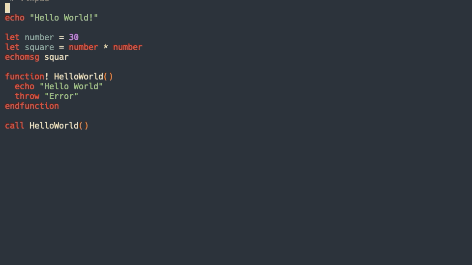
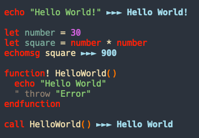
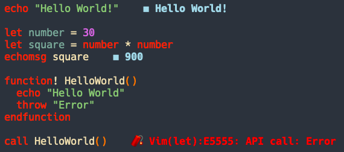

# nvim-vimpad

Like codi and luapad but for vimscript.

Makes use of the virtual text feature in neovim.




## Installation

* vim-plug
```viml
Plug 'yuki-uthman/nvim-vimpad'
```

* vundle
```viml
Plugin 'yuki-uthman/nvim-vimpad'
```

* minpac:
```viml
call minpac#add('yuki-uthman/nvim-vimpad')

" for lazy loading
call minpac#add('yuki-uthman/nvim-vimpad', { 'type': 'opt' })
packadd nvim-vimpad
```


## Quickstart

No default mappings are provided with this plugin.
Put this in your init.vim.
```viml
  " change the key bindings to your liking
  nmap <leader>o <Plug>(vimpad-on)
  nmap <leader>f <Plug>(vimpad-off)
  nmap <leader>t <Plug>(vimpad-toggle)
  nmap <leader>r <Plug>(vimpad-refresh)
```
Now you can press `<leader>o` or `<leader>r` to turn on the vimpad output.
Pressing the `<leader>f` or `<leader>r` again disables it.

By default the vimpad output refreshes whenever the file is saved.
If you would like to disable that autocmd:
```viml
  let g:vimpad_refresh_on_save = 0
```

## Configurations

With no configuration, the appearance of the output looks like the one below.


To change the prefix of the output:
```viml
  let g:vimpad_prefix = '▷▷▷'
```



To change the prefix of the error output:
```viml
  let g:vimpad_prefix = '🧨'
```


To add more spaces before output:
```viml
  " number of spaces to add in front of output
  let g:vimpad_add_space = 1
```



Two main highlight groups are used(VimpadOutput and VimpadOutputError). To 
change color you can link the vimpad highlight group to the existing highlight 
group provided by your colorscheme or you can define the colors yourself:
```vimL
" Linking to the existing group
highlight link VimpadOutput      PmenuSel
highlight link VimpadOutputError ErrorMsg

" to see all the highlight groups
:highlight

" Defining your own colors
" for terminal
" ctermfg as the font golor
" ctermbg as the background color
highlight VimpadOutput      ctermfg='cyan' ctermbg='bg'
highlight VimpadOutputError ctermfg='red' ctermbg='bg'

" for gui
" guifg as the font golor
" guibg as the background color
highlight VimpadOutput      guifg='White' guibg='Black'
highlight VimpadOutputError guifg='White' guibg='Black'
```
The following colors are available in most systems:
  - Black
  - Brown
  - Gray
  - Blue
  - Green
  - Cyan
  - Red
  - Magenta
  - Yellow
  - White

To see more colors:
```vimL
h cterm-colors
h gui-colors
```

To set the color using RGB:
```vimL
:highlight flasherColor guifg=#11f0c3 guibg=#ff00ff
```

## Powerline Style Output

If you are feeling more adventurous you can also make it look like the 
powerline!

For powerline looking output you have to tweak the highlight of the shapes on 
the both side of the output. Depending on the shape you would have to reverse 
its color. The Highlight groups being used for the shapes are named with prefix 
and suffix respectively. The examples are shown below.

Round shape:


Right arrow:


Left arrow:


And finally Fireeeeeeeeeeeeee:
